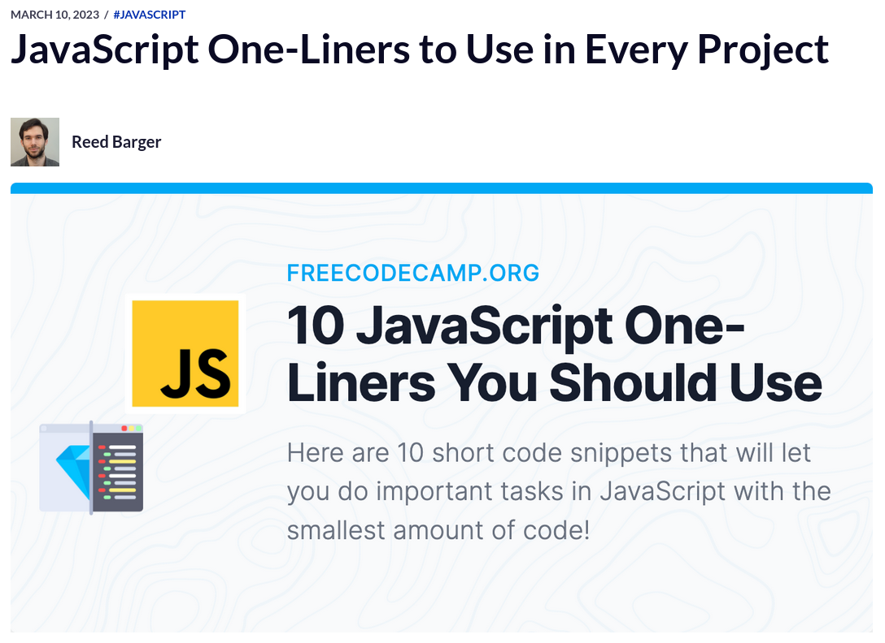

# JavaScript-One-Liners
 This web page is inspired by the www.freecodecamp.org article:
 [JavaScript One-Liners to Use in Every Project](https://www.freecodecamp.org/news/javascript-one-liners-to-use-in-every-project/)
 

The freecodecamp article only aims to show the code (and that's fine) and doesn't address how it might be applied, so in my learning path I try to show how these functions and concepts might be applied in a way that you can interact with them and see them working in a practical way. In some cases I have used the sample code exactly as it is in the article, and in other cases I have changed and added other things to make the example work. 
